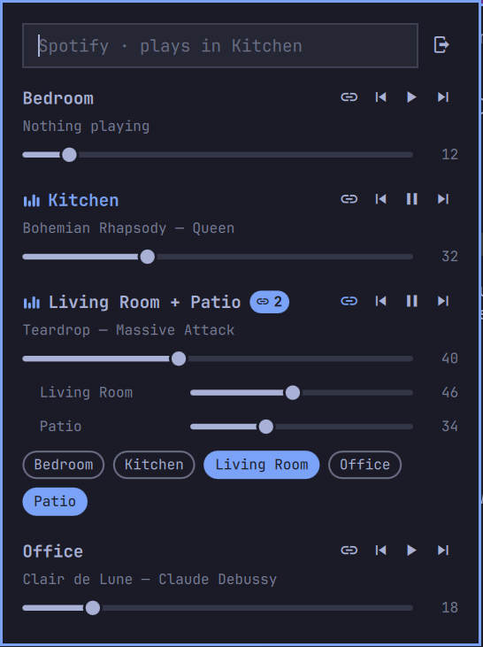

# Sonos for Omarchy

A fast Sonos bar widget for the Omarchy shell. A speaker icon in the bar opens a compact popup with every room or group: what's playing, play/pause/skip, volume per group and per speaker, room grouping and Spotify search.



Official Sonos apps are slow. This one talks straight to the speakers on your network, updates the popup the moment you press something and lets the speakers confirm in the background.

## Install

```sh
omarchy plugin add https://github.com/freber/omarchy-sonos.git --enable
```

Needs `python3` (standard library only). Speakers are found automatically.

## Remove

```sh
omarchy plugin remove freber.sonos
rm -rf ~/.config/omasonos ~/.cache/omasonos.json ~/.cache/omasonos-spotify-token.json
```

The second line removes the Spotify login and the cached speaker addresses. Nothing else on the system is changed.

## Use

- **Bar icon:** left click opens the popup. Middle click plays/pauses. Scroll changes the volume of the room that's playing.
- **Rooms:** each group shows an animated spectrum while playing. Long names scroll.
- **Grouping:** the link button (or the 🔗 badge on a group) expands it to one volume slider per speaker plus chips for every room. Tap a chip to add or remove that room; it pulses until Sonos confirms.
- **Search:** type in the search field, pick where it plays with the "Play in" chips, then `enter` or click a result. `esc` clears, then closes.

## Spotify search

Sonos keeps your Spotify login on the speakers but doesn't expose search on the local network. Search uses Spotify's Web API instead. Playback still goes through the Spotify account linked in Sonos.

The popup shows a login card until Spotify is connected:

1. Once: create an app on the [Spotify dashboard](https://developer.spotify.com/dashboard) with redirect URI `http://127.0.0.1:8888/callback` (the card has a copy button) and Web API ticked. Paste its Client ID.
2. Click **Log in with Spotify** and approve in the browser.

The login uses OAuth with PKCE (no client secret). A refresh token is kept in `~/.config/omasonos/spotify.json` (readable only by you), so you log in once. The button next to the search field logs out.

US Spotify accounts add `"sonos_service": 3079` to that file.

## Troubleshooting

- **No speakers found:** discovery uses SSDP with a subnet scan as fallback. If your speakers are on another VLAN, set their IP on the widget's entry in `~/.config/omarchy/shell.json`: `{ "id": "freber.sonos", "hosts": "192.168.1.20" }`.
- **`redirect_uri: Not matching configuration`:** the redirect URI in your Spotify app must be exactly `http://127.0.0.1:8888/callback`. Save the app settings after adding it.

## How it works

`sonos` is a small Python helper (standard library only) that speaks UPnP to the speakers. Speaker addresses are cached in `~/.cache/omasonos.json`, so a full status update is one parallel round trip. Volume changes are sent one at a time with the newest value, so dragging a slider never lands out of order.

## License

MIT
